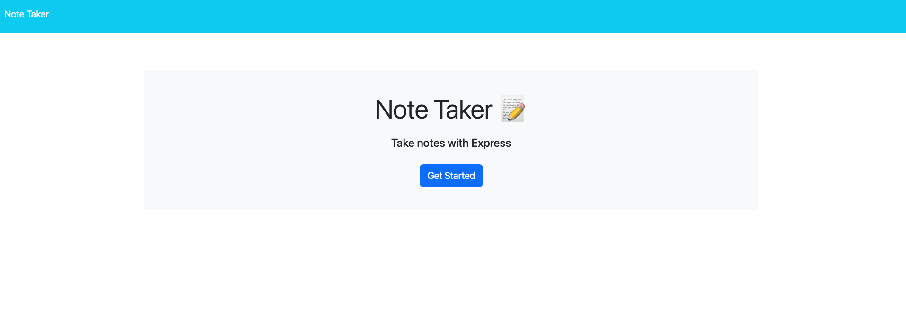
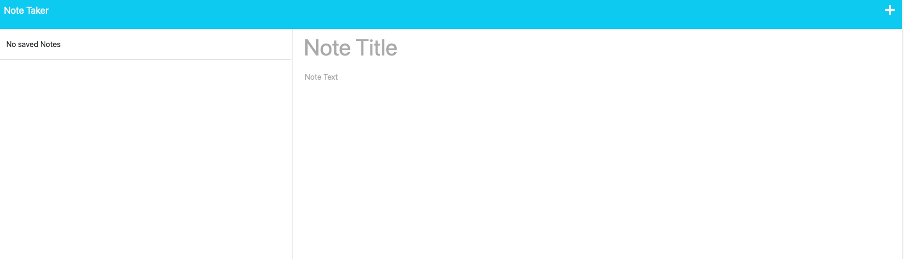
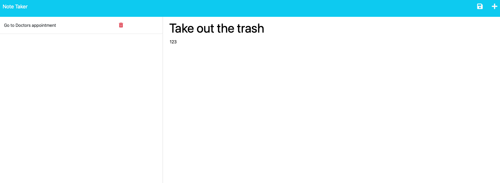

# Note-Saver 

  

  ## Description
  
  This project was created to help users create and save notes similar to a to do list. This is a fully functioning application with a backend using node, and express.js. The project was also created to help further my knowledge of express and how importand the back end coding is to how a website functions and aides in helping to enhance the user experience. Creating a functioning API proved to be a challenge, however, I was able to learn the importance of naming conventions and how the server response heavily impacts what the front end of the website can do with the information that is being provided by the API. Overall this project proved to be a challenge, but it definitely helped expand my knowledge and understanding of Node and Express.
  
  ## Table of Contents
  
  - [Installation](#installation)
  - [Usage](#usage)
  - [Credits](#credits)
  - [License](#license)
  - [Contributions](#how-to-contribute)
  - [Tests](#tests)
  - [Questions](#questions)
  
  ## Installation
  
  N/A
  
  ## Usage

  Navigate to:   https://note-saver-uofm-54de8f7c842c.herokuapp.com   You will be greeted by the start page:
  
  Click on the "Get Started" button to be taken to the notes page.
  
  To create a new note, simply click in the blank Title and Text area and write your note. 
  To save your note, simply click the save button at the top right, represented by the floppy disk. 
  

  ## Credits
  
  Source code and the front end of the application is from: https://git.bootcampcontent.com/University-of-Minnesota/UofM-VIRT-FSF-PT-04-2023-U-LOLC-ENTG/-/tree/main/11-Express/02-Challenge

  ## License

  This project is licensed under the MIT License

  ## How to Contribute
  
  N/A
  
  ## Tests
  
  N/A

  ## Questions
  
  My work can be found on Github at [alexanderolivares13](https://www.github.com/alexanderolivares13)

  If you have any further questions you can contact me at my email at: [alexander.olivares1310@gmail.com](mailto:alexander.olivares1310@gmail.com)

